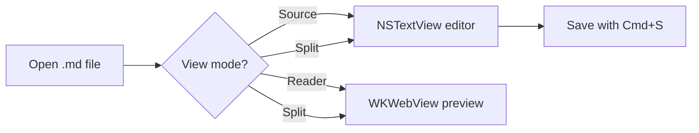

# MDReader Demo Document

A torture test for every feature of the reader view.

## GFM basics

Some **bold**, some *italic*, some ~~strikethrough~~, an `inline code span`,
and an autolink: https://daringfireball.net/projects/markdown/

> A blockquote with **bold** inside it.
> Second line of the quote.

### Table

| Feature    | Status | Notes                 |
|------------|:------:|-----------------------|
| Tables     |   ✅   | with alignment        |
| Task lists |   ✅   | checkboxes below      |
| Mermaid    |   ✅   | diagram further down  |

### Task list

- [x] design the app
- [x] write the plan
- [ ] build milestone M3
- [ ] ship it

### Ordered list

1. First item
2. Second item
   1. Nested item
3. Third item

## Code

Inline `let x = 1` and fenced blocks:

```swift
struct MarkdownDocument: FileDocument {
    var text: String
    // syntax highlighting via highlight.js
    func render() -> String { text.uppercased() }
}
```

```python
def fib(n: int) -> int:
    """Recursive Fibonacci — highlighted as Python."""
    return n if n < 2 else fib(n - 1) + fib(n - 2)
```

A dollar amount like $5 or $10 must NOT become math, and neither must `$x$`
inside a code span.

## Math (KaTeX)

Inline math: $e^{i\pi} + 1 = 0$ and $x^2 + y^2 = r^2$.

Block math:

$$
\int_{-\infty}^{\infty} e^{-x^2}\,dx = \sqrt{\pi}
$$

## Mermaid



## Image (relative path)


## Raw HTML (should stay literal text)

<b>this raw html must appear as literal text, not bold</b>

---

Final horizontal rule above. The end.
